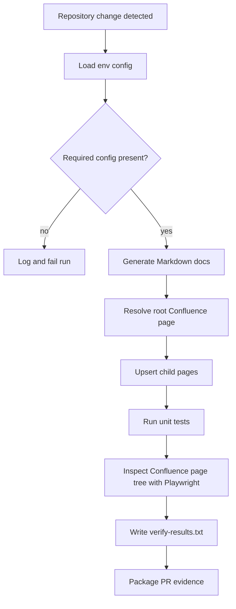
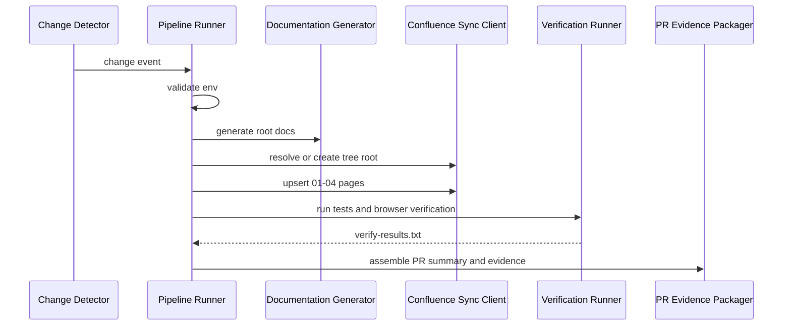

# System Architecture

## Overview

The repository will implement a modular Node.js pipeline that detects repository changes, generates SDLC documentation, synchronizes the documentation tree to Confluence, verifies the published pages, and prepares evidence for pull request automation.

The current repository is minimal, so the architecture is intentionally lightweight and layered around a small set of responsibilities rather than a large framework.

## Design Goals

1. Keep the workflow deterministic and idempotent.
2. Fail safely after logging when external services are unavailable.
3. Minimize duplicate Confluence pages across reruns.
4. Separate change detection, document generation, publishing, verification, and PR packaging into distinct modules.

## Proposed Components

### 1. Change Detector

* Watches for repository changes or receives a change event from the caller.
* Produces a normalized trigger payload that identifies what changed and whether the pipeline should run.

### 2. Config Loader

* Reads all runtime configuration from environment variables.
* Validates presence of required secrets and target identifiers before the pipeline starts.

### 3. Shared Atlassian Client

* Centralizes Jira and Confluence requests behind one adapter.
* Normalizes HTTP failures into explicit pipeline errors.
* Redacts secrets, headers, and access tokens from logs.

### 4. Documentation Generator

* Produces the root Markdown files in the repository:

  * `requirements.md`
  * `architecture.md`
  * `design-review.md`
  * `impl-plan.md`

* Keeps the documents aligned with the Jira story and the current pipeline state.

### 5. Confluence Sync Client

* Resolves or creates the root page `[PROJECT] Automated Documentation Sync Pipeline`.
* Creates or updates the four child pages under the root page.
* Uses page identity checks so reruns update existing pages instead of duplicating them.

### 6. Verification Runner

* Runs unit tests for happy-path and failure-path coverage.
* Uses Playwright MCP to inspect the live Confluence page tree.
* Writes the run output to `verify-results.txt`.

### 7. PR Evidence Packager

* Collects the generated docs, verification logs, and summary data.
* Packages the evidence for GitHub pull request creation.

## Data Flow

## Runtime Sequence

## Failure Handling Model

* Missing config, malformed payloads, API rate limits, network failures, `404 Not Found`, and `500 Server Error` responses are treated as fatal for the current run after logging.
* The pipeline should not continue after a fatal external dependency failure.
* Each module should return explicit errors so the caller can distinguish configuration issues from publishing or verification failures.
* The shared Atlassian client should be the only place that formats remote requests and remote error details.
* Logs must never include raw tokens, authorization headers, or full secret values.

## Module Boundaries

* The change detector does not generate documentation.
* The documentation generator does not talk to Confluence.
* The Confluence sync client does not run tests.
* The verification runner does not create pull requests.
* The PR evidence packager depends on the results of prior stages, not on live Confluence edits.

## Technology Direction

* Runtime: Node.js
* Module format: CommonJS, matching the current `package.json`
* External integrations: Atlassian MCP, Playwright MCP, GitHub MCP

## Architecture Notes

* The design favors small, testable functions over a monolithic pipeline script.
* The Confluence tree root should be treated as a stable anchor for all documentation pages.
* The implementation should prefer idempotent upserts over blind page creation.
