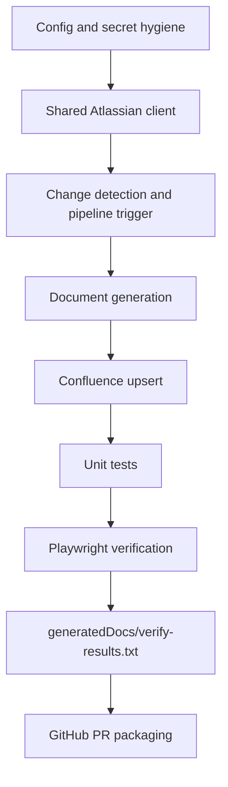

# Implementation Plan

## Objective

Deliver a modular Node.js pipeline that detects repository changes, generates SDLC documentation, syncs a Confluence tree, verifies the published pages, and packages evidence for pull request automation.

For this run, keep the active slice centered on documentation generation, Confluence synchronization, and verification evidence. The remaining tasks still belong to the story, but the implementation sequence should stay narrow and deterministic.

## Task Breakdown

### Phase 1: Project Foundation

1. Confirm repository scripts and runtime assumptions.
2. Add baseline configuration loading from `.env` and `process.env`.
3. Enforce secret hygiene through the pre-commit secret guard and `.gitignore` coverage.
4. Define the runtime boundaries for docs generation, sync, verification, and PR packaging.

### Phase 2: Shared Atlassian Integration

5. Build a shared Atlassian client for Jira and Confluence requests.
6. Normalize API errors, redact secrets, and retry transient failures before failing on unrecoverable external dependency responses.
7. Add helpers for locating the root Confluence page and child pages.

### Phase 3: Documentation Pipeline

8. Implement the codebase change detector or pipeline trigger adapter.
9. Implement document generation for `generatedDocs/requirements.md`, `generatedDocs/architecture.md`, `generatedDocs/design-review.md`, and `generatedDocs/impl-plan.md`.
10. Add idempotent Confluence page upsert logic for the root page and four child pages.

### Phase 4: Verification and Evidence

11. Add unit tests for happy paths and failure paths, including missing credentials and missing Confluence targets.
12. Implement Playwright MCP verification for the live Confluence tree.
13. Write run output to `generatedDocs/verify-results.txt`.

### Phase 5: PR Packaging

14. Assemble the summary, changelog, and verification evidence for GitHub pull request creation.
15. Verify the pipeline produces repeatable output on reruns.

## Dependency Order

## Deliverables

* Root Markdown files kept current in `generatedDocs/`.
* Confluence tree rooted at `[PROJECT] Automated Documentation Sync Pipeline`.
* Verification logs exported to `generatedDocs/verify-results.txt`.
* A PR-ready summary with testing evidence.

## Success Criteria

* Re-running the workflow updates existing Confluence pages instead of duplicating them.
* Missing configuration or upstream API failures stop the current run after logging, with transient retries attempted first.
* The final verification step confirms the page tree structure and the published page titles.